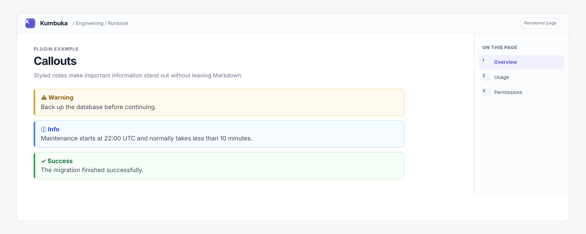

# Callouts

Callouts adds styled note and warning blocks to Kumbuka Markdown pages.



## Usage

```markdown
!!! warning
Back up the database before continuing.
```

Supported kinds are `note`, `info`, `tip`, `success`, `warning`, `danger`, and `error`. The callout body is rendered as Markdown. Callout syntax inside fenced code blocks stays literal.

## Permissions

This plugin does not request any Kumbuka capabilities.
