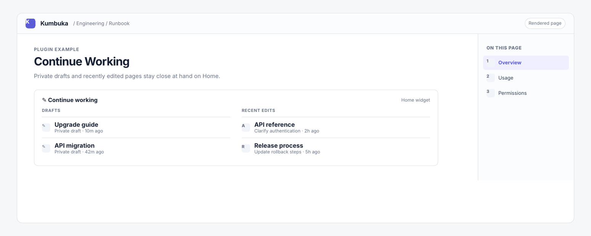

# Continue Working

Continue Working shows bounded private draft metadata and the current viewer's recently edited pages on Home. Draft form values never leave Kumbuka core.

## Permissions

- `activity:read` reads the current viewer's recently edited visible page metadata.
- `drafts:read` reads private draft metadata for the current viewer without editor form values.
