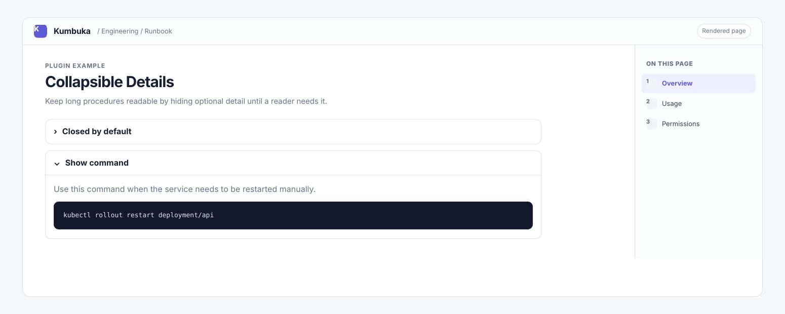

# Collapsible Details

Collapsible Details renders `???` blocks as native expandable sections while keeping their body as normal Kumbuka Markdown.



## Usage

```markdown
??? "Closed by default"

    Markdown content.
```

Use `???+` to start the section open:

```markdown
???+ "Open by default"

    More Markdown content.
```

The declaration must start at the beginning of a line. Body content is indented by four spaces or one tab. Detail declarations inside fenced code blocks remain literal.

## Permissions

This plugin requests no Kumbuka capabilities. Body Markdown is rendered by Kumbuka through the normal plugin pipeline and sanitizer.
