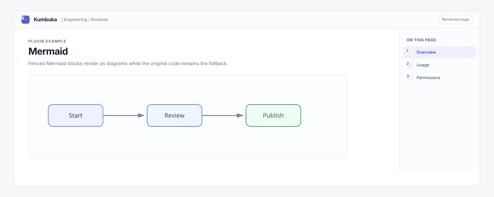
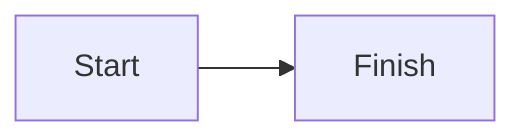

# Mermaid

Mermaid renders fenced `mermaid` code blocks as diagrams in an isolated browser frame. The original code block remains available as a fallback when the browser module is unavailable or the plugin is disabled.



## Usage

````markdown

````

Use `mermaid` as the fenced code-block language. Mermaid source is rendered only in the browser module and remains normal code when the plugin is unavailable.

## Permissions

This plugin requests `browser:render` so its packaged JavaScript and CSS can render diagrams in the isolated plugin frame.

## Development

Run `./mermaid/update-assets.sh` from the repository root to refresh the vendored Mermaid JavaScript and license.
