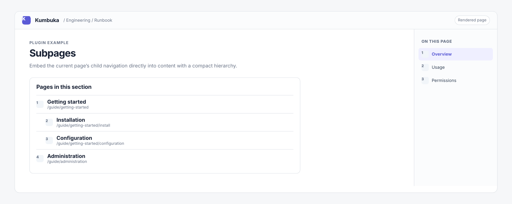

# Subpages

Subpages adds the `{{subpages}}` macro for showing the current page's child navigation.



## Usage

```text
{{subpages}}
```

The default heading is **Pages in this section**. Set a custom heading or hide it completely with the `title` option:

```text
{{subpages title="Related pages"}}
{{subpages title=""}}
```

## Permissions

This plugin requests `pages:read` to read the current page's navigation children.
