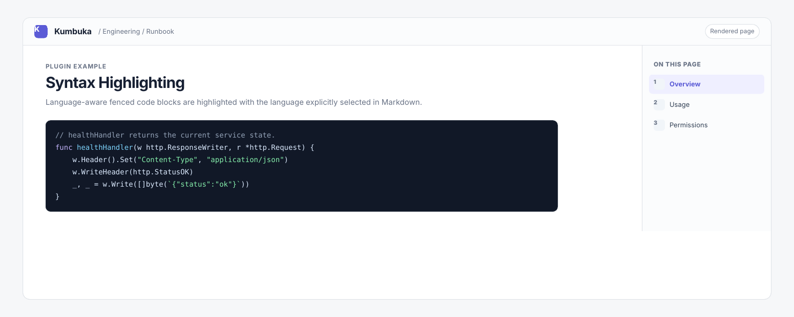

# Syntax Highlighting

Syntax Highlighting highlights fenced code blocks using Chroma and the explicit Markdown fence language supplied by Kumbuka.



## Usage

````markdown
```go
func main() {
    println("Kumbuka")
}
```
````

The plugin uses Chroma's complete maintained lexer registry rather than a curated subset, so every language and alias shipped by the pinned Chroma version is available.

Kumbuka already knows the language from each fenced code block and passes it directly to the plugin. Every block is highlighted independently with that exact Chroma language name or alias, so one page may freely mix Go, Python, SQL, YAML, or any other supported language. The plugin never auto-detects from source text and never treats the fence value as a filename. Empty or unsupported fence languages return unmatched and fall back to an ordinary fenced code block. Pages without fenced code do not select this module during rendering.

This bundled plugin is Kumbuka's default provider for the exclusive `code-highlighter` contribution. Disable it before enabling another plugin that provides its own highlighter. Kumbuka itself does not depend on Chroma once this plugin is disabled.

The plugin owns its token markup and presentation stylesheet. Kumbuka sanitizes the returned HTML and filters/scopes the stylesheet before either reaches rendered page content.

## Permissions

This plugin requests no Kumbuka capabilities.
