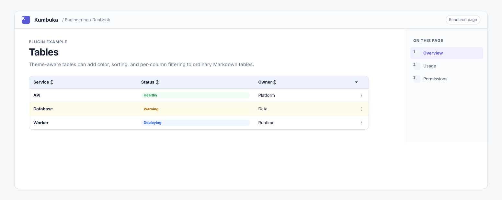

# Tables

Tables adds Markdown tables with optional theme-aware colors, client-side sorting, and per-column filtering.



## Usage

```markdown
| Service | Status  | Owner    |
| ------- | ------- | -------- |
| API     | Healthy | Platform |
| DB      | Warning | Data     |

{table header=accent col:2=info row:2=warning cell:2,2=danger sortable filterable}
```

Rows and columns in table directives are one-based. Supported tones are `accent`, `accent-soft`, `info`, `success`, `warning`, `danger`, `neutral`, `gray`, `blue`, `purple`, `green`, `yellow`, `orange`, and `red`.

## Settings

**Table colors** enables directive-based colors. **Table sorting** enables `sortable`. **Table filtering** enables `filterable`. All three settings require the main Tables feature.

## Permissions

This plugin requests `browser:render` for its isolated sorting and filtering browser module. The normal rendered table remains the fallback when browser enhancements are unavailable.
