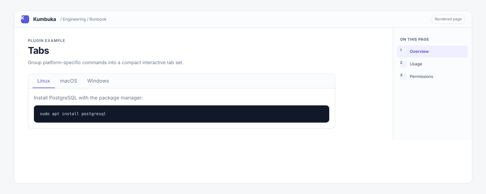

# Tabs

Tabs renders consecutive Material-style tab declarations as an interactive tab group while keeping each panel body as normal Kumbuka Markdown.



## Usage

````markdown
=== "Linux"

    ```bash
    apt install postgresql
    ```

=== "macOS"

    ```bash
    brew install postgresql
    ```
````

Tab declarations must start at the beginning of a line. Panel content is indented by four spaces or one tab. Tabs inside fenced code blocks remain literal.

## Permissions

This plugin requests no Kumbuka capabilities. Panel Markdown is rendered by Kumbuka through the normal plugin pipeline and sanitizer.
